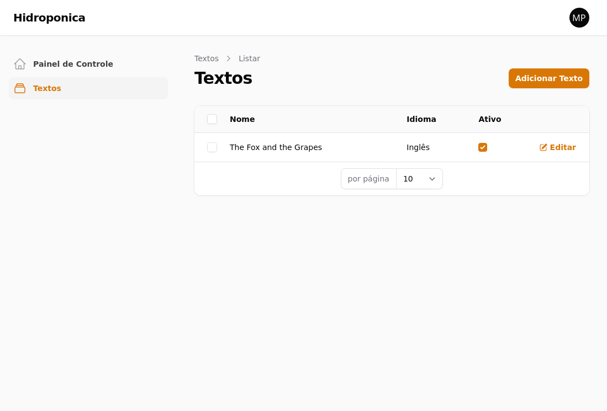
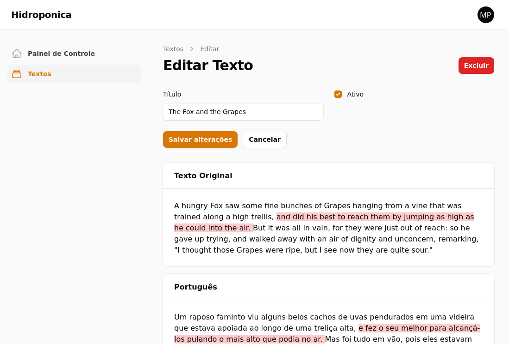
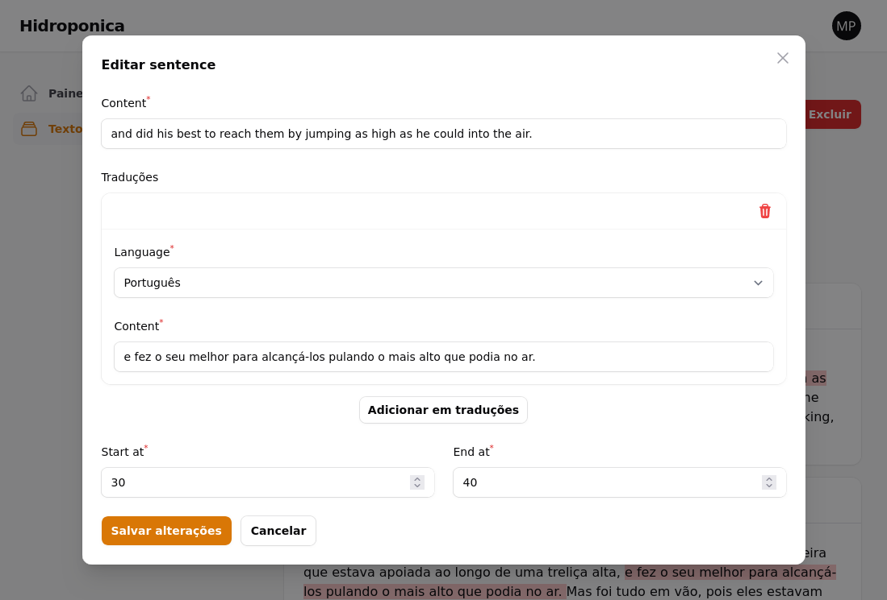
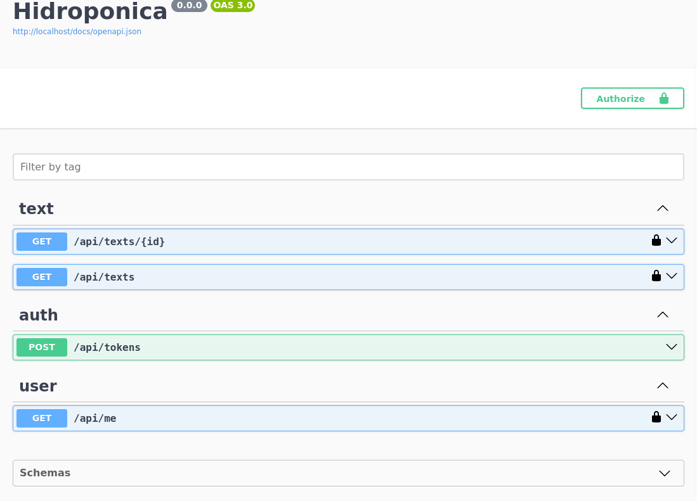

# Hidroponica

[](http://neni.dev/emojicom)

Sistema de gerenciamento e API com textos traduzidos para estudar com *listening*

## Screenshots

<details>


<!-- 1100 x 790 -->

### Backoffice







### Referência da API com OpenAPI/Swagger




</details>

## Desenvolvimento

### Ambiente

1. Duplique `.env.example` para `.env` e **mude o usuário (`DB_USERNAME`) e senha (`DB_PASSWORD`)**

```sh
cp .env.example .env
```

2. Baixe o Sail juntamente com as dependências do composer
```sh
docker run -v $(pwd):/var/www/html -w /var/www/html laravelsail/php82-composer:latest sh -c "composer config --global && composer install --ignore-platform-reqs"
```

3. Suba o ambiente
```sh
./vendor/bin/sail up -d
```

> Esse comando é <a href="#Execução">utilizado sempre que quiser subir o ambiente ja configurado</a> também

4. Crie a `APP_KEY`
```sh
./vendor/bin/sail artisan key:generate
```

5. Crie as tabelas com alguns registros do *seeder*
```sh
./vendor/bin/sail artisan migrate:fresh --seed
```

6. Baixe as dependências javascript
```sh
./vendor/bin/sail npm i
```

7. Crie a documentação de referência que ficará disponível em `localhost/api/reference`
```sh
./vendor/bin/sail artisan vendor:publish --provider "L5Swagger\L5SwaggerServiceProvider"
./vendor/bin/sail artisan l5-swagger:generate
```

### Execução

1. Inicie o backend se necessário
```sh
./vendor/bin/sail up -d
```

> Interrompa com `./vendor/bin/sail down`

2. Inicie o frontend
```sh
./vendor/bin/sail npm start
```

> Interrompa com <kbd>ctrl</kbd><kbd>c</kbd>

3. Acesse o sistema:
    - `localhost/admin`: `admin@hidroponi.ca` `123`

Outros comandos úteis durante o desenvolvimento:

- `sail bash`
- `sail psql`
- `sail tinker`
- `sail artisan queue:work`
- `sail artisan optimize:clear`
- `sail composer i`

### Linting

```sh
./vendor/bin/sail php ./vendor/bin/pint
./vendor/bin/sail php ./vendor/bin/pint --dirty
```

### Testes

#### Ambiente

```sh
./vendor/bin/sail psql
create database hidroponica_testing;
```

#### Execução

```sh
./vendor/bin/sail test
./vendor/bin/sail test tests/Feature/BlablaTest.php
./vendor/bin/sail test --parallel --no-coverage
./vendor/bin/sail test --filter nomeDoTeste
```

#### QA

É mantido em paralelo os [testes automatizados](http://github.com/nenitf/hidroponiqa) de api e interface web
